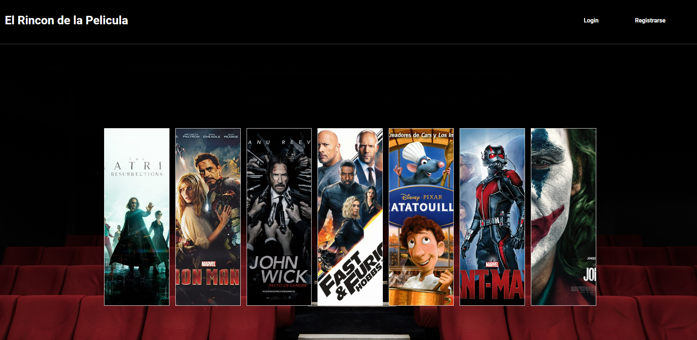
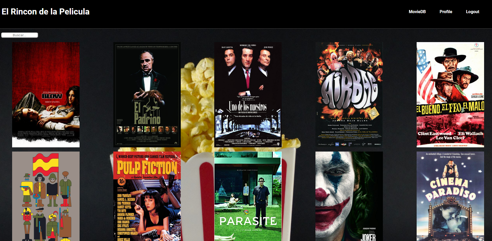

# Toc

- [Toc](#toc)
- [El rincon de la película](#el-rincon-de-la-película)
- [The website](#the-website)
- [Img](#img)
- [Result](#result)
  - [Author](#author)
      - [Luciano Germani :it:](#luciano-germani-it)
      - [Ibrahim Alzuru Cortés  :venezuela:](#ibrahim-alzuru-cortés--venezuela)
      - [Marc Serrats Pagès :es:](#marc-serrats-pagès-es)

# El rincon de la película

*If you prefer you can read this in* [Spanish](README-ESP.md)

This project was made using React / Redux / Sass and aiming to a MongoDB Database. To check the back-end project you can click here : [Buscador de Películas](https://github.com/Germanilu/Buscador-De-Peliculas).

# The website

The user can complete a register form and make a login into the website, also the user will be able to see the movie available on the website and rent one.
You can also check your profile, edit your profile and to be able to rent a new movie you will need to return the previouse one. 

The App contain the following endpoint:

- Register
- Login
- Home
- MovieDatabase
- Profile
- Edit profile
- Movie Detail
- Order

# Img

# Result

You can see the website here: [El Rincon De la Pelicula](https://dev.d1w3l4s3mddekq.amplifyapp.com/).

## Author 	

#### [Luciano Germani](https://github.com/Germanilu) :it:
#### [Ibrahim Alzuru Cortés ](https://github.com/ibralzuru) :venezuela:
#### [Marc Serrats Pagès](https://github.com/pagesMp) :es:

---------------------

[:top:](#toc)
